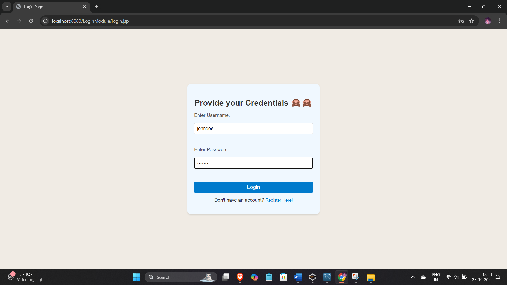

# Login Module

This repository contains a simple **Login and Registration** module developed using **JSP**, **Servlets**, **HTML**, **CSS**, **MySQL**, and **Java**. It allows users to register, log in, and maintain session management for authentication purposes.

## Features

- **User Registration**: New users can register by providing their details.
- **User Login**: Registered users can log in using their credentials.
- **Session Management**: After login, user sessions are managed to ensure secure authentication.
- **Logout**: Users can securely log out and their session will be invalidated.
- **Password Hashing**: User passwords are stored securely using hashing techniques.

## Tech Stack

- **Frontend**: HTML, CSS
- **Backend**: JSP, Servlets, Java
- **Database**: MySQL
- **Session Management**: Java Servlets (using HttpSession)

## Prerequisites

Before you begin, ensure you have met the following requirements:

- You have installed Java JDK 8 or above.
- You have installed Apache Tomcat Server 9.0 or above.
- You have MySQL installed and running.

## Getting Started

Follow these instructions to set up and run the project on your local machine.

### 1. Clone the repository

```bash
git clone https://github.com/yourusername/login-module.git
cd login-module
```

### 2. Set up MySQL Database

- Open MySQL and run the following SQL commands to create the database and user table:

```sql
CREATE DATABASE login_db;

USE login_db;

CREATE TABLE users (
    id INT NOT NULL AUTO_INCREMENT,
    firstname VARCHAR(50),
    lastname VARCHAR(50),
    email VARCHAR(100),
    username VARCHAR(50) NOT NULL,
    password VARCHAR(255) NOT NULL,
    PRIMARY KEY (id)
);
```

### 3. Configure Database Connection

Update the database connection details in the file: `src/db/DBConnection.java`

```java
private static final String URL = "jdbc:mysql://localhost:3306/login_db";
private static final String USER = "your_mysql_username";
private static final String PASSWORD = "your_mysql_password";
```

### 4. Deploy on Apache Tomcat

- Place the project in your Tomcat `webapps` folder.
- Start the Apache Tomcat server and visit:

```
http://localhost:8080/login-module/
```

### 5. Register and Login

- Go to the registration page to create a new account.
- After successful registration, log in using your credentials.
- Once logged in, the system will maintain a session, and you will be redirected to the dashboard.

## Project Structure

```bash
login-module/
│
├── src/
│   ├── com/
│   │   ├── controller/
│   │   │   ├── LoginServlet.java
│   │   │   ├── LogoutServlet.java
│   │   │   ├── RegisterServlet.java
│   │   │
│   │   ├── dao/
│   │   │   └── UserDao.java
│   │   │
│   │   ├── model/
│   │   │   └── User.java
│   │   │
│   │   └── db/
│   │       └── DBConnection.java
│   │
├── web/
│   ├── index.jsp
│   ├── login.jsp
│   ├── register.jsp
│   ├── dashboard.jsp
│   └── logout.jsp
│
└── README.md
```

## Screenshots

| **Login Page**         | **Registration Page**   |
|------------------------|-------------------------|
|    |  |
